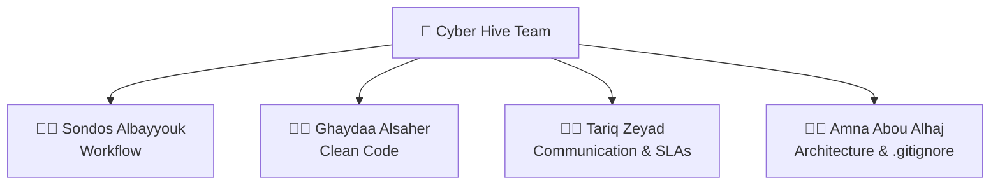

<h1>
  
  Cyber Hive
  
</h1>

<h2>Software Development Team Charter</h2>

<h3><em>Small Cells. One Hive. One Mission.</em></h3>

---

## 🐝 About Our Team

We are **Cyber Hive**, a team of four members participating in the **ByteBloom Academy** training program. We came together with a shared passion for learning, collaboration, and gaining practical experience in software development through teamwork and real-world challenges.

We believe that success begins with effective communication, mutual respect, and knowledge sharing. By supporting one another and working toward a common goal, we strive to grow both as individuals and as a team throughout our ByteBloom journey.

---

## 🎯 Vision & Mission

> Our mission is to work as one team, learn from one another, and continuously develop our technical and collaboration skills through teamwork, practical experience, and knowledge sharing. We are committed to supporting each other, delivering high-quality work, and striving to become one of the top-performing teams in the **ByteBloom Academy** program.

---

## 🐝 Inside the Hive

---

### 🐝 Explore the Hive

Choose a section below to explore each part of our Team Charter.

 

---

## 🔄 Workflow

**Responsible Member:** Sondos Albayyouk  
**Branch:** `feature/charter-sondosalbayyouk`

<!-- Sondos writes and formats the Workflow section here. -->

   

---

## 💻 Clean Code Standards

**Responsible Member:** Ghaydaa Alsaher  
**Branch:** `feature/charter-ghaydaaalsaher`

<!-- Ghaydaa writes and formats the Clean Code section here. -->

   

---

## 📡 Communication & SLAs

**Responsible Member:** Tariq Zeyad  
**Branch:** `feature/charter-tariqzeyad`

<!-- Tariq writes and formats the Communication and SLA section here. -->

   

---

## 🏗️ Architecture & `.gitignore`

**Responsible Member:** Amna Abou Alhaj  
**Branch:** `feature/charter-amnaaboualhaj`

<!-- Amna writes and formats the Architecture and .gitignore section here. -->

   

---

## 🤝 Team Agreement

We are committed to:

- Following the agreed team standards.
- Completing our assigned responsibilities.
- Respecting deadlines and communication.
- Supporting each other throughout the project.
- Working together to achieve our shared goals.

---

## Cyber Hive

### Build Together • Review Together • Grow Together

**One Team • One Repository • One Standard**

