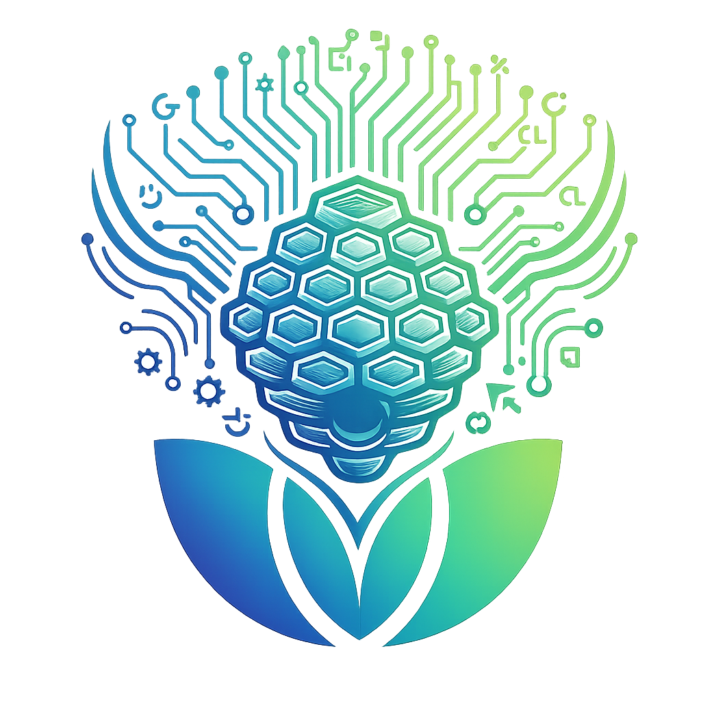
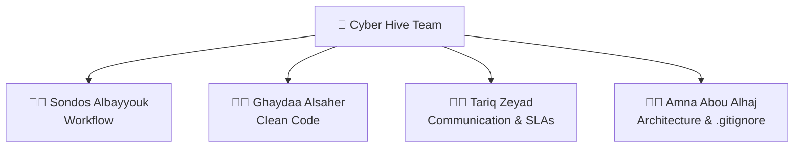
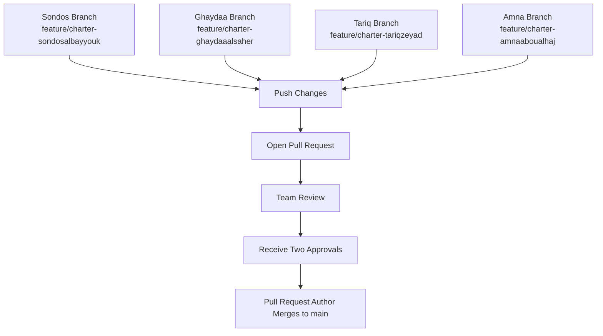

<div align="center">

<h1>
  
  Cyber Hive
  
</h1>

<h2>Software Development Team Charter</h2>

<h3><em>Small Cells. One Hive. One Mission.</em></h3>


</div>


---

## 🐝 About Our Team

We are **Cyber Hive**, a team of four members participating in the **ByteBloom Academy** training program.

United by a shared passion for technology and continuous learning, we collaborate to gain practical experience, strengthen our software development skills, and grow together through teamwork.

---

## 🎯 Our Mission

Our mission is to build a collaborative and supportive team environment where every member can learn, contribute, and grow together. By applying software engineering best practices, embracing responsibility, and working toward a common goal, we aim to become one of the top-performing teams in the **ByteBloom Academy** program.

---

## 🐝 Inside the Hive



---

### 🐝 Explore the Hive

Choose a section below to explore each part of our Team Charter.

<div align="center">

<br>

<a href="#workflow">
  
</a>

<a href="#clean-code">
  
</a>

<a href="#communication">
  
</a>

<a href="#architecture">
  
</a>

</div>

---

<a id="workflow"></a>

## 🔄 Workflow

**Responsible Member:** Sondos Albayyouk

---

### 👥 Team Roles

| Team Member | Role | Responsibilities |
|-------------|------|------------------|
| **Sondos Albayyouk** | Workflow | Organizes the team workflow, branch management, and the Push, Pull Request, and Merge process. |
| **Ghaydaa Alsaher** | Clean Code Standards | Defines coding standards, naming conventions, and Clean Code practices. |
| **Tariq Zeyad** | Communication & SLAs | Organizes team communication, response times, and peer review guidelines. |
| **Amna Abou Alhaj** | Architecture & `.gitignore` | Organizes the project structure and defines the `.gitignore` rules. |
---

### 🔀 Branching Model

Our team follows the **Feature Branch Workflow**.

Each member works on a separate feature branch for their assigned task. After completing the work, the member pushes the changes and creates a Pull Request. Once the required approvals are received, the Pull Request author merges the changes into the `main` branch.

---

### 👨‍💻 Team Workflow



---

### 📋 Workflow Rules

To keep our development process organized and consistent, the team follows these rules:

- Each member works on their own feature branch.
- No direct commits are allowed to the `main` branch.
- Every change must be submitted through a Pull Request.
- At least two team members must approve the Pull Request before merging.
- After receiving the approvals, the Pull Request author performs the merge.
- Resolve merge conflicts collaboratively before merging changes into the `main` branch.
- Keep your feature branch up to date before opening a Pull Request.
- Use clear and meaningful commit messages.
---

### 💬 Commit Message Convention

To keep the commit history clear and consistent, the team follows these commit message conventions:

- Use short and meaningful commit messages.
- Start each commit message with a standard prefix.
- Write commit messages in English.

**Common prefixes:**

| Prefix | Purpose |
|--------|---------|
| `feat:` | Add a new feature |
| `fix:` | Fix a bug or issue |
| `docs:` | Update documentation |
| `style:` | Improve formatting or styling |
| `refactor:` | Improve code without changing functionality |
| `test:` | Add or update tests |
| `chore:` | Perform general maintenance tasks |

<br>

---
<a id="clean-code"></a>

## 🧹 Clean Code Standards

**Responsible Member:** Ghaydaa Alsaher  
> ### "Leave the campground cleaner than you found it."
>
> *— Robert C. Martin, Clean Code*


---

### 🧭 Our Clean Code Philosophy

Our team is committed to writing clean, readable, and maintainable code to ensure consistency and make collaboration easier for everyone.

---

### 🏷️ Naming Standards

To improve readability and maintain consistency, our team follows these naming principles:

- Use meaningful and descriptive names.
- Avoid misleading or unclear names.
- Use nouns for class names.
- Use verbs for function names.

---

### ⚙️ Function Standards

Functions should be simple, focused, and easy to understand.

Our team will:

- Keep functions small and focused.
- Ensure each function has a single responsibility.
- Use clear and descriptive function names.
- Make every function perform only the task described by its name.

---

### 💬 Comment Standards

Comments should support the code, not replace clear and readable code.

Our team will:

- Prefer self-explanatory code.
- Use comments only when they add value.
- Explain *why*, not *what*.
- Remove unnecessary or outdated comments.

---

### 📏 Formatting Standards

Consistent formatting improves readability and makes collaboration easier across the project.

Our team will:

- Use consistent indentation.
- Organize code in a logical structure.
- Remove unused code and unnecessary imports.

---

### ✅ Clean Code Checklist

Before creating a Pull Request, every team member should verify:

- [ ] Meaningful names are used.
- [ ] Functions have one responsibility.
- [ ] Formatting follows the team standard.
- [ ] Code is easy to read and understand.

---

### 🧹 Continuous Improvement

Inspired by the *Boy Scout Rule*, every team member should leave the code a little better than they found it by making small improvements whenever they modify existing code.

<br><br><br>

---

<a id="communication"></a>

## 📡 Communication & SLAs

**Responsible Member:** Tariq Zeyad  
**Branch:** `feature/charter-tariqzeyad`

<!-- Tariq writes and formats the Communication and SLA section here. -->

<br><br>

---

<a id="architecture"></a>

## 🏗️ Architecture & `.gitignore`

**Responsible Member:** Amna Abou Alhaj  

---

### 📁 Repository Structure

The repository follows a simple and organized structure to keep project files clear and easy to manage.

```text
CyberHive/
│
├── assets/              # Images and visual resources
├── gradle/              # Gradle wrapper files
├── src/main/kotlin/     # Kotlin source code
├── .gitignore
├── build.gradle.kts
├── gradle.properties
├── gradlew
├── gradlew.bat
├── settings.gradle.kts
├── README.md
└── TEAM_CHARTER.md
```

---

### 📂 Directory Guidelines

- Store source code inside the `src/main/kotlin` directory.
- Store images and visual resources inside the `assets` directory.
- Keep documentation files in the project root.
- Keep Gradle configuration files in their default locations.
- Follow the agreed repository structure when adding new files.

---

### 🚫 `.gitignore` Rules

The `.gitignore` file excludes generated and local development files from the repository.

```text
.idea/
.gradle/
build/
out/
*.iml
```

These files are automatically generated or contain local IDE settings and should not be committed.

---

### 📦 Repository Organization

- Keep the repository clean and well organized.
- Commit only project-related source code and documentation.
- Remove unnecessary generated files before committing.
- Keep build configuration files valid and up to date.
- Follow the agreed repository structure throughout the project.

---

## 🤝 Team Agreement

We are committed to:

- Following the agreed team standards.
- Completing our assigned responsibilities.
- Respecting deadlines and communication.
- Supporting each other throughout the project.
- Working together to achieve our shared goals.

---

<div align="center">


## Cyber Hive

### Build Together • Review Together • Grow Together

**One Team • One Repository • One Standard**

</div>